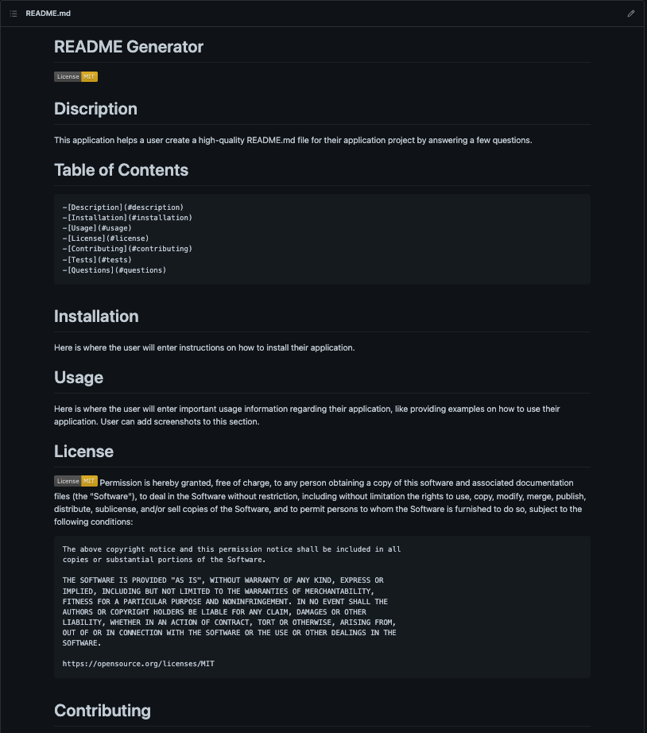

# README Generator

# Discription
This application helps a user create a high-quality README.md file for their application project by answering a few questions.

# Installation & Usage

Install Node JS and follow steps in following video on how to use the application.

# Application Mock-Up

# Github Repository

[GitHub Repository Link](https://github.com/marvanessa1/ReadMe)

  